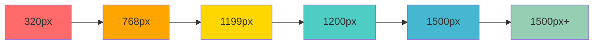
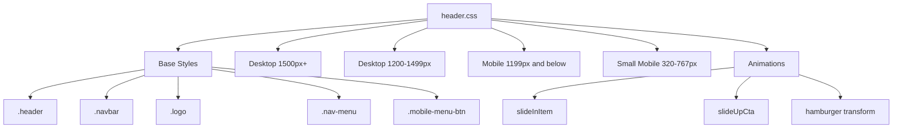

# Header Redesign Plan - Liwonde Sun Hotel Website

## Overview
Complete and thorough fix of the header.php with responsive design across all screen sizes. All header CSS will be extracted from `css/style.css` into a dedicated `css/header.css` file.

## Current State Analysis

### Files Involved
- **includes/header.php** (78 lines) - Contains header structure
- **css/style.css** (6454+ lines) - Contains scattered header CSS

### Current Header Structure
```php
<header class="header">
    <div class="container">
        <nav class="navbar">
            <a href="/" class="logo">
                <?php if (!empty($site_logo)): ?>
                " alt="<?php echo htmlspecialchars($site_name); ?>" class="logo-image" />
                <?php endif; ?>
                <span class="logo-text"><?php echo htmlspecialchars($site_name); ?></span>
                <svg class="logo-hotel-icon" width="18" height="18" viewBox="0 0 24 24">
                    <!-- Hotel icon SVG paths -->
                </svg>
            </a>
            <ul class="nav-menu" id="primary-nav">
                <!-- 8 nav items: Home, Rooms, Restaurant, Gym, Conference, Events, Contact, Book Now -->
            </ul>
            <button class="mobile-menu-btn" type="button">
                <span class="menu-icon">
                    <span></span>
                    <span></span>
                    <span></span>
                </span>
            </button>
        </nav>
    </div>
</header>
```

### Current Issues
1. Header CSS scattered throughout `style.css` (lines 175-515 and media queries)
2. Overlapping issues at 1200-1499px breakpoint
3. Inconsistent mobile layout across different screen sizes
4. Multiple overlapping media queries (768px, 1190px, 1191px)

## Responsive Breakpoint Strategy

### Breakpoint Overview



### Detailed Breakpoint Specifications

#### 1. Desktop 1500px+ (Keep Current Look)
**Status:** ✅ Preserve existing design

| Element | Behavior |
|---------|----------|
| Navbar | Full menu visible (8 items) |
| Logo | Image + text + SVG icon |
| Hamburger | Hidden |
| Layout | Flexbox with adequate spacing |

**CSS Target:** `@media (min-width: 1500px)`

---

#### 2. Desktop 1200-1499px (Fix Overlapping)
**Status:** 🔧 Fix overlapping, match 1500px appearance

| Element | Behavior |
|---------|----------|
| Navbar | Full menu visible (same as 1500px+) |
| Nav Items | Reduced spacing to fit 8 items |
| Font Sizes | Slightly scaled down (90-95%) |
| Logo | Same as 1500px+ |
| Hamburger | Hidden |

**CSS Target:** `@media (min-width: 1200px) and (max-width: 1499px)`

**Key Fixes:**
- Reduce `.nav-item` padding from `1rem 1.5rem` to `0.75rem 1rem`
- Scale `.logo-text` from `1.5rem` to `1.35rem`
- Adjust `.nav-link` font-size from `1rem` to `0.9rem`

---

#### 3. Mobile 1199px and Below (Mobile Header Layout)
**Status:** 📱 Complete mobile redesign

| Element | Position | Behavior |
|---------|----------|----------|
| Hotel Icon | Far left | `position: fixed; left: 1rem;` |
| Logo Text | Centered | `position: fixed; left: 50%; transform: translateX(-50%);` |
| Hamburger | Far right | `position: fixed; right: 1rem;` |
| Nav Menu | Hidden | Full-screen overlay when active |

**CSS Target:** `@media (max-width: 1199px)`

**Mobile Layout Specifications:**
```
┌─────────────────────────────────────┐
│ [🏨]        LIWONDE SUN        [☰] │
└─────────────────────────────────────┘
  ↑            ↑               ↑
  left: 1rem   centered      right: 1rem
```

**Z-Index Stack:**
- Header: `z-index: 1000`
- Mobile menu overlay: `z-index: 1001`
- Mobile menu items: `z-index: 1002`

---

#### 4. Small Mobile 320px-767px (Additional Adjustments)
**Status:** 📱 Extra small screen optimizations

| Element | Adjustment |
|---------|------------|
| Logo Text | Font size `1rem` (from `1.2rem`) |
| Hotel Icon | Size `16px` (from `18px`) |
| Hamburger | Size `24px` (from `28px`) |
| Padding | Reduced to `0.75rem` |

**CSS Target:** `@media (max-width: 767px)`

---

## File Structure Changes

### New File: css/header.css

```
css/
├── header.css          # NEW: All header styles
├── style.css           # UPDATED: Header CSS removed
└── footer-fixes.css    # Existing
```

### Header CSS Organization



## CSS Classes to Extract

### From style.css (lines 175-515 and media queries):

| Class | Current Lines | Purpose |
|-------|---------------|---------|
| `.header` | 175-198 | Main header container |
| `.navbar` | 206-211 | Navigation bar |
| `.logo` | 214-239 | Logo container |
| `.logo-image` | 242-247 | Logo image |
| `.logo-text` | 289-339 | Logo text styling |
| `.logo-hotel-icon` | 325-332 | SVG hotel icon |
| `.nav-menu` | 407-562 | Navigation menu |
| `.nav-item` | 342-406 | Menu items |
| `.nav-link` | 342-406 | Menu links |
| `.mobile-menu-btn` | 459-508 | Hamburger button |
| `.menu-icon` | 459-508 | Hamburger icon spans |
| `.nav-menu.active` | 407-562 | Active mobile menu |

### Animations to Extract:
- `@keyframes slideInItem` (lines 502-511)
- `@keyframes slideUpCta` (lines 591-600)
- Any hamburger transformation animations

## Implementation Steps

### Phase 1: File Creation
1. Create `css/header.css` with organized structure
2. Add CSS comment headers for each section

### Phase 2: Base Styles (1500px+)
1. Copy existing header styles from `style.css`
2. Organize into logical sections
3. Ensure current appearance is preserved

### Phase 3: Desktop 1200-1499px
1. Add `@media (min-width: 1200px) and (max-width: 1499px)`
2. Reduce nav item spacing
3. Scale font sizes appropriately
4. Test for overlapping issues

### Phase 4: Mobile 1199px and Below
1. Add `@media (max-width: 1199px)`
2. Position hotel icon: `position: fixed; left: 1rem; top: 1rem;`
3. Position logo text: `position: fixed; left: 50%; top: 1rem; transform: translateX(-50%);`
4. Position hamburger: `position: fixed; right: 1rem; top: 1rem;`
5. Ensure z-index layering
6. Add uniform padding: `1rem` on all sides

### Phase 5: Small Mobile 320-767px
1. Add `@media (max-width: 767px)`
2. Further reduce font sizes
3. Adjust icon sizes
4. Ensure everything fits within 320px width

### Phase 6: Integration
1. Update `includes/header.php` to include new `<link>` tag
2. Remove all header CSS from `css/style.css`
3. Verify no broken references

### Phase 7: Testing
1. Test at 320px width
2. Test at 375px width
3. Test at 768px width
4. Test at 1199px width
5. Test at 1200px width
6. Test at 1400px width
7. Test at 1500px width
8. Test at 1920px width

## Mobile Menu Behavior

### Closed State
```css
.nav-menu {
    position: fixed;
    top: 0;
    left: -100%;
    width: 100%;
    height: 100vh;
    background: rgba(0, 0, 0, 0.95);
    backdrop-filter: blur(10px);
    transition: left 0.3s ease;
}

.nav-menu.active {
    left: 0;
}
```

### Menu Items Animation
```css
.nav-item {
    opacity: 0;
    transform: translateX(-20px);
    transition: all 0.3s ease;
}

.nav-menu.active .nav-item {
    opacity: 1;
    transform: translateX(0);
}
```

## Hamburger Menu Animation

### Closed → Open Transition
```css
.mobile-menu-btn.active .menu-icon span:nth-child(1) {
    transform: rotate(45deg) translate(5px, 5px);
}

.mobile-menu-btn.active .menu-icon span:nth-child(2) {
    opacity: 0;
}

.mobile-menu-btn.active .menu-icon span:nth-child(3) {
    transform: rotate(-45deg) translate(7px, -6px);
}
```

## Color Scheme

| Element | Color | Usage |
|---------|-------|-------|
| Header Background | `linear-gradient(135deg, rgba(20,20,20,0.95), rgba(40,40,40,0.95))` | Desktop |
| Header Background | `rgba(20,20,20,0.98)` | Mobile |
| Nav Link (Default) | `#e0e0e0` | |
| Nav Link (Hover) | `#d4af37` | Gold |
| Nav Link (Active) | `#d4af37` | Gold |
| Mobile Menu Background | `rgba(0,0,0,0.95)` | |

## Accessibility Considerations

1. **ARIA Labels:** Ensure all buttons have proper labels
2. **Keyboard Navigation:** Tab through menu items
3. **Focus States:** Visible focus indicators
4. **Screen Readers:** Proper semantic HTML structure
5. **Touch Targets:** Minimum 44x44px for mobile

## Browser Compatibility

- Chrome/Edge: ✅ Full support
- Firefox: ✅ Full support
- Safari: ✅ Full support (with `-webkit-` prefixes for backdrop-filter)
- Mobile Safari: ✅ Full support
- Chrome Mobile: ✅ Full support

## Success Criteria

- [ ] No overlapping at any breakpoint
- [ ] Smooth transitions between breakpoints
- [ ] Mobile menu works on all screen sizes 320px-1199px
- [ ] Full navbar visible 1200px+
- [ ] All header CSS in separate file
- [ ] No header CSS remaining in style.css
- [ ] Consistent padding and spacing
- [ ] All elements properly aligned
- [ ] Hamburger, logo, icon never overlap

## Notes

- Previous work used `position: fixed` with `z-index: 1001` for mobile elements
- Ensure JavaScript in `js/main.js` properly toggles `.nav-menu.active` and `.mobile-menu-btn.active`
- Test with actual content (8 nav items) to verify spacing
- Consider using CSS custom properties for easier maintenance
