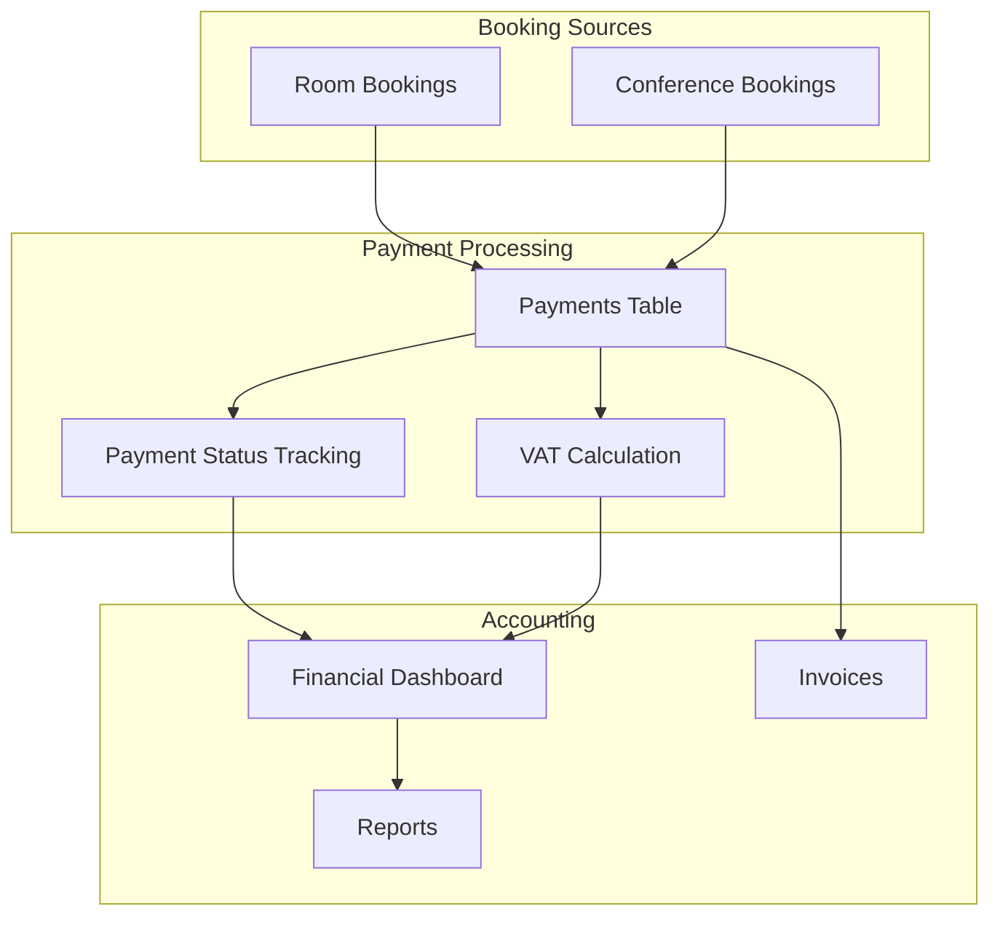
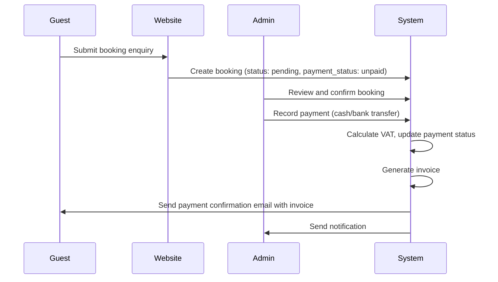
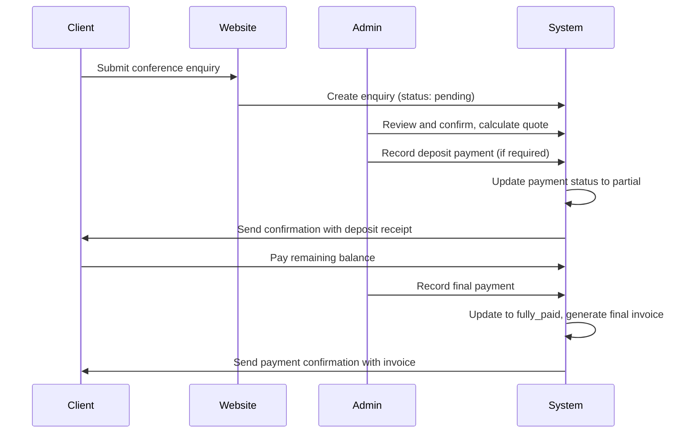

# Payments and Accounting System Design

## Overview
A comprehensive payments and accounting system for Liwonde Sun Hotel to track all financial transactions for room bookings and conference bookings, with VAT support, payment status tracking, and financial reporting.

## System Architecture



## Database Schema

### 1. Payments Table (New)
Central table to track all payments across room and conference bookings.

```sql
CREATE TABLE `payments` (
  `id` int UNSIGNED NOT NULL AUTO_INCREMENT,
  `payment_reference` varchar(50) NOT NULL UNIQUE COMMENT 'Unique payment reference like PAY-2026-000001',
  `booking_type` enum('room','conference') NOT NULL COMMENT 'Type of booking',
  `booking_id` int UNSIGNED NOT NULL COMMENT 'ID from bookings or conference_inquiries table',
  `booking_reference` varchar(50) NOT NULL COMMENT 'Reference from booking (LSH2026xxxx or CONF-2026-xxxx)',
  `payment_date` date NOT NULL,
  `payment_amount` decimal(10,2) NOT NULL COMMENT 'Amount paid before VAT',
  `vat_rate` decimal(5,2) NOT NULL DEFAULT 0.00 COMMENT 'VAT percentage (e.g., 16.50 for 16.5%)',
  `vat_amount` decimal(10,2) NOT NULL DEFAULT 0.00 COMMENT 'Calculated VAT amount',
  `total_amount` decimal(10,2) NOT NULL COMMENT 'Total including VAT',
  `payment_method` enum('cash','bank_transfer','mobile_money','credit_card','debit_card','cheque','other') NOT NULL DEFAULT 'cash',
  `payment_reference_number` varchar(100) DEFAULT NULL COMMENT 'Transaction ID, receipt number, or cheque number',
  `payment_status` enum('pending','partial','fully_paid','overdue','refunded') NOT NULL DEFAULT 'pending',
  `invoice_generated` tinyint(1) NOT NULL DEFAULT 0 COMMENT 'Whether invoice has been generated',
  `invoice_path` varchar(255) DEFAULT NULL COMMENT 'Path to generated invoice file',
  `notes` text DEFAULT NULL COMMENT 'Additional payment notes',
  `recorded_by` int UNSIGNED DEFAULT NULL COMMENT 'Admin user who recorded the payment',
  `created_at` timestamp NOT NULL DEFAULT CURRENT_TIMESTAMP,
  `updated_at` timestamp NOT NULL DEFAULT CURRENT_TIMESTAMP ON UPDATE CURRENT_TIMESTAMP,
  PRIMARY KEY (`id`),
  UNIQUE KEY `payment_reference` (`payment_reference`),
  KEY `idx_booking_type_id` (`booking_type`, `booking_id`),
  KEY `idx_payment_date` (`payment_date`),
  KEY `idx_payment_status` (`payment_status`),
  KEY `idx_recorded_by` (`recorded_by`),
  CONSTRAINT `fk_payments_admin` FOREIGN KEY (`recorded_by`) REFERENCES `admin_users` (`id`) ON DELETE SET NULL
) ENGINE=InnoDB DEFAULT CHARSET=utf8mb4 COLLATE=utf8mb4_unicode_ci COMMENT='All payment transactions for room and conference bookings';
```

### 2. VAT/Tax Settings (Add to site_settings)

```sql
INSERT INTO `site_settings` (`setting_key`, `setting_value`, `setting_group`, `description`, `display_order`) VALUES
('vat_enabled', '1', 'accounting', 'Enable VAT calculation on invoices', 100),
('vat_rate', '16.5', 'accounting', 'VAT percentage rate (e.g., 16.5 for 16.5%)', 101),
('vat_number', 'MW123456789', 'accounting', 'Company VAT registration number', 102),
('currency_code', 'MWK', 'general', 'ISO currency code (MWK, USD, EUR, etc.)', 103),
('payment_terms', 'Payment due upon check-in', 'accounting', 'Default payment terms for invoices', 104),
('invoice_prefix', 'INV', 'accounting', 'Prefix for invoice numbers', 105),
('invoice_start_number', '1001', 'accounting', 'Starting invoice number for the year', 106);
```

### 3. Update Bookings Table

Add columns to track payment summary:

```sql
ALTER TABLE `bookings`
ADD COLUMN `amount_paid` decimal(10,2) NOT NULL DEFAULT 0.00 COMMENT 'Total amount paid so far' AFTER `total_amount`,
ADD COLUMN `amount_due` decimal(10,2) NOT NULL DEFAULT 0.00 COMMENT 'Remaining amount to be paid' AFTER `amount_paid`,
ADD COLUMN `vat_rate` decimal(5,2) NOT NULL DEFAULT 0.00 COMMENT 'VAT rate applied' AFTER `amount_due`,
ADD COLUMN `vat_amount` decimal(10,2) NOT NULL DEFAULT 0.00 COMMENT 'VAT amount' AFTER `vat_rate`,
ADD COLUMN `total_with_vat` decimal(10,2) NOT NULL DEFAULT 0.00 COMMENT 'Total amount including VAT' AFTER `vat_amount`,
ADD COLUMN `last_payment_date` date DEFAULT NULL COMMENT 'Date of last payment' AFTER `total_with_vat`,
ADD INDEX `idx_payment_status` (`payment_status`);
```

### 4. Update Conference Inquiries Table

Add columns to track payment summary:

```sql
ALTER TABLE `conference_inquiries`
ADD COLUMN `amount_paid` decimal(10,2) NOT NULL DEFAULT 0.00 COMMENT 'Total amount paid so far' AFTER `total_amount`,
ADD COLUMN `amount_due` decimal(10,2) NOT NULL DEFAULT 0.00 COMMENT 'Remaining amount to be paid' AFTER `amount_paid`,
ADD COLUMN `vat_rate` decimal(5,2) NOT NULL DEFAULT 0.00 COMMENT 'VAT rate applied' AFTER `amount_due`,
ADD COLUMN `vat_amount` decimal(10,2) NOT NULL DEFAULT 0.00 COMMENT 'VAT amount' AFTER `vat_rate`,
ADD COLUMN `total_with_vat` decimal(10,2) NOT NULL DEFAULT 0.00 COMMENT 'Total amount including VAT' AFTER `vat_amount`,
ADD COLUMN `last_payment_date` date DEFAULT NULL COMMENT 'Date of last payment' AFTER `total_with_vat`,
ADD COLUMN `deposit_required` tinyint(1) NOT NULL DEFAULT 0 COMMENT 'Whether deposit is required' AFTER `last_payment_date`,
ADD COLUMN `deposit_amount` decimal(10,2) DEFAULT NULL COMMENT 'Required deposit amount' AFTER `deposit_required`,
ADD COLUMN `deposit_paid` tinyint(1) NOT NULL DEFAULT 0 COMMENT 'Whether deposit has been paid' AFTER `deposit_amount`;
```

## Payment Flow

### Room Booking Payment Flow



### Conference Booking Payment Flow



## Payment Status States

### Room Bookings
- **unpaid**: No payments received yet
- **partial**: Deposit or partial payment received
- **paid**: Full payment received
- **overdue**: Payment past due date (if applicable)

### Conference Bookings
- **pending**: Enquiry received, no payment yet
- **partial**: Deposit paid, balance pending
- **paid**: Full payment received
- **overdue**: Payment past due date

## Admin Pages Required

### 1. Accounting Dashboard (`admin/accounting-dashboard.php`)
- Financial overview cards
- Total revenue (current month, year)
- Pending payments
- Overdue payments
- VAT collected summary
- Payment method breakdown
- Recent transactions list
- Charts: Revenue trends, payment status distribution

### 2. Payments List (`admin/payments.php`)
- Filterable list of all payments
- Search by reference, guest name, company
- Filter by date range, status, booking type
- Export to CSV/Excel
- Actions: View details, edit, regenerate invoice

### 3. Add Payment (`admin/payment-add.php`)
- Form to record new payment
- Select booking (room or conference)
- Auto-fill booking details
- Payment amount input
- VAT calculation (auto if enabled)
- Payment method selection
- Reference number input
- Notes field
- Generate invoice checkbox

### 4. Payment Details (`admin/payment-details.php`)
- Full payment information
- Booking details
- Payment history timeline
- Invoice preview/download
- Edit payment option
- Refund payment option

### 5. Reports (`admin/reports.php`)
- Financial reports
- Revenue by period (daily, weekly, monthly, yearly)
- Revenue by room type
- Conference revenue
- VAT reports
- Outstanding payments report
- Payment method analysis
- Export options

## API Endpoints

### Payment Management API

```php
// Get all payments with filters
GET /api/payments.php?type=room|conference&status=paid|partial|pending&date_from=2026-01-01&date_to=2026-01-31

// Get payment details
GET /api/payments.php?id=123

// Create new payment
POST /api/payments.php
{
  "booking_type": "room",
  "booking_id": 15,
  "payment_amount": 50000.00,
  "payment_method": "cash",
  "payment_reference_number": "REC-001",
  "notes": "Cash payment received"
}

// Update payment
PUT /api/payments.php?id=123
{
  "payment_amount": 50000.00,
  "payment_method": "bank_transfer",
  "notes": "Updated payment method"
}

// Delete payment (with confirmation)
DELETE /api/payments.php?id=123

// Get payment summary for a booking
GET /api/payments-summary.php?booking_type=room&booking_id=15

// Generate invoice for payment
POST /api/generate-invoice.php?payment_id=123

// Get financial dashboard data
GET /api/financial-dashboard.php?period=month&year=2026

// Export payments to CSV
GET /api/payments-export.php?format=csv&date_from=2026-01-01&date_to=2026-01-31
```

## Key Features

### 1. VAT Calculation
- Configurable VAT rate in settings
- Automatic VAT calculation on payments
- VAT amount displayed separately on invoices
- VAT reports for tax filing

### 2. Payment Tracking
- Track multiple payments per booking
- Partial payment support
- Deposit tracking for conferences
- Payment history timeline

### 3. Invoice Integration
- Auto-generate invoices on payment
- Include VAT breakdown
- Support for both room and conference bookings
- PDF/HTML invoice generation
- Email invoices to customers

### 4. Financial Dashboard
- Real-time financial overview
- Revenue metrics
- Outstanding payments
- VAT collected
- Payment method breakdown
- Visual charts and graphs

### 5. Reporting
- Revenue by period
- Revenue by room type
- Conference revenue
- VAT reports
- Outstanding payments
- Payment method analysis
- Export to CSV/Excel

### 6. Audit Trail
- Track who recorded each payment
- Timestamp for all changes
- Payment history log
- Invoice generation log

## Security Considerations

1. **Payment Recording**: Only authenticated admin users can record payments
2. **Audit Trail**: All payment changes logged with user ID
3. **Data Integrity**: Foreign key constraints ensure referential integrity
4. **Validation**: Server-side validation for all payment amounts
5. **Error Handling**: Proper error handling and logging

## Migration Strategy

1. Create new `payments` table
2. Add VAT settings to `site_settings`
3. Update `bookings` table with payment tracking columns
4. Update `conference_inquiries` table with payment tracking columns
5. Create payment management pages
6. Create API endpoints
7. Update invoice generation to include VAT
8. Create accounting dashboard
9. Test with sample data
10. Deploy to production

## Future Enhancements

1. Online payment gateway integration
2. Automated payment reminders
3. Recurring payments for long-term bookings
4. Multi-currency support
5. Expense tracking
6. Profit/loss reporting
7. Integration with accounting software (QuickBooks, Xero)
8. Receipt printing
9. Partial refund support
10. Payment plans/installments
