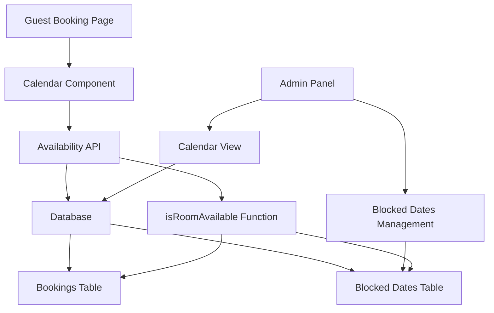
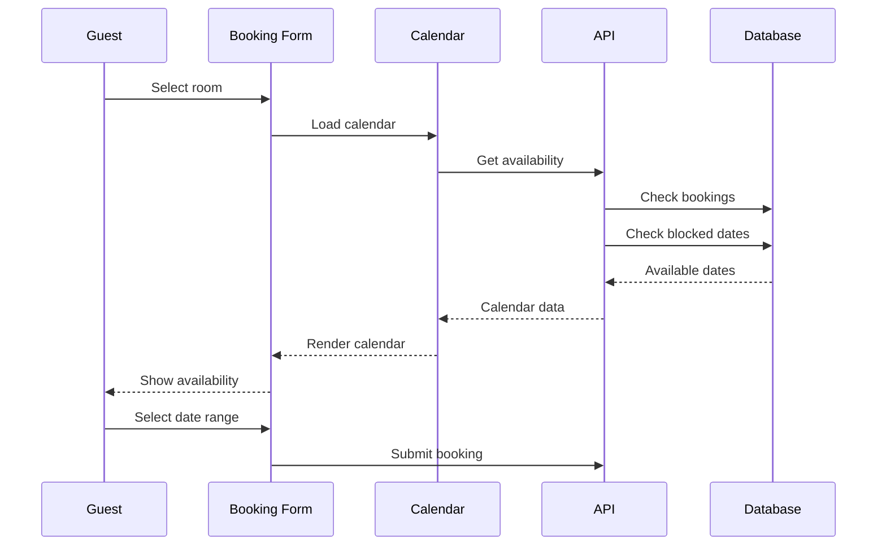
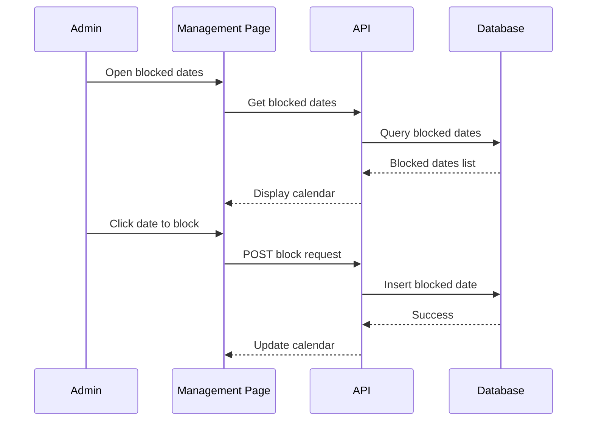

# Room Availability System - Complete Implementation Plan

## Executive Summary

This plan outlines the implementation of a comprehensive room availability system with:
- Visual calendar picker for guests
- Admin interface for blocking dates/rooms
- Database-driven blocked dates management
- Real-time availability checking

## Current System Analysis

### Existing Components
| Component | File | Status | Notes |
|------------|-------|--------|-------|
| Availability Check Function | [`config/database.php`](config/database.php:733) | ✅ Working | Checks bookings only |
| Detailed Availability Check | [`config/database.php`](config/database.php:780) | ✅ Working | Returns conflicts |
| API Availability Endpoint | [`api/availability.php`](api/availability.php) | ✅ Working | API for availability checks |
| Booking Form | [`booking.php`](booking.php) | ⚠️ Limited | Standard date inputs only |
| Admin Calendar | [`admin/calendar.php`](admin/calendar.php) | ✅ Working | Shows bookings, no blocking |

### Identified Gaps
1. **No visual calendar picker** - Booking form uses standard HTML date inputs
2. **No manual blocking mechanism** - Admin cannot block dates for maintenance/events
3. **No blocked dates table** - Database lacks storage for blocked dates
4. **Limited date range visibility** - Users can't see availability at a glance

## Database Schema Design

### New Table: `room_blocked_dates`

```sql
CREATE TABLE `room_blocked_dates` (
  `id` int UNSIGNED NOT NULL AUTO_INCREMENT,
  `room_id` int UNSIGNED NOT NULL COMMENT 'NULL means block all rooms',
  `block_date` date NOT NULL COMMENT 'Date to block',
  `block_type` enum('maintenance','event','manual','full') NOT NULL DEFAULT 'manual' COMMENT 'Reason for blocking',
  `reason` varchar(255) DEFAULT NULL COMMENT 'Optional reason for blocking',
  `created_by` int UNSIGNED DEFAULT NULL COMMENT 'Admin user who created block',
  `created_at` timestamp NOT NULL DEFAULT CURRENT_TIMESTAMP,
  PRIMARY KEY (`id`),
  KEY `idx_room_date` (`room_id`, `block_date`),
  KEY `idx_block_date` (`block_date`),
  CONSTRAINT `fk_blocked_room` FOREIGN KEY (`room_id`) REFERENCES `rooms` (`id`) ON DELETE CASCADE,
  CONSTRAINT `fk_blocked_admin` FOREIGN KEY (`created_by`) REFERENCES `admin_users` (`id`) ON DELETE SET NULL
) ENGINE=InnoDB DEFAULT CHARSET=utf8mb4 COLLATE=utf8mb4_unicode_ci
COMMENT='Manually blocked dates for rooms';
```

### Field Descriptions
| Field | Type | Description |
|-------|--------|-------------|
| `id` | INT UNSIGNED | Primary key |
| `room_id` | INT UNSIGNED | Room ID (NULL = block all rooms) |
| `block_date` | DATE | Date to block |
| `block_type` | ENUM | Reason: maintenance, event, manual, full |
| `reason` | VARCHAR(255) | Optional explanation |
| `created_by` | INT UNSIGNED | Admin user who blocked |
| `created_at` | TIMESTAMP | Creation timestamp |

## Implementation Plan

### Phase 1: Database Layer

#### 1.1 Create Blocked Dates Table
- Create migration SQL file
- Add indexes for performance
- Add foreign key constraints

#### 1.2 Update Availability Functions
- Modify [`isRoomAvailable()`](config/database.php:733) to check blocked dates
- Modify [`checkRoomAvailability()`](config/database.php:780) to include blocked dates
- Add new function `getBlockedDates($room_id, $start_date, $end_date)`
- Add new function `blockRoomDate($room_id, $date, $type, $reason)`
- Add new function `unblockRoomDate($block_id)`

### Phase 2: Backend API

#### 2.1 Create Blocked Dates API
**File:** `api/blocked-dates.php`

Endpoints:
- `GET /api/blocked-dates` - List blocked dates
- `POST /api/blocked-dates` - Create block
- `DELETE /api/blocked-dates/{id}` - Remove block

#### 2.2 Update Availability API
**File:** [`api/availability.php`](api/availability.php)
- Include blocked dates in response
- Return available dates range for calendar rendering

### Phase 3: Admin Interface

#### 3.1 Create Blocked Dates Management Page
**File:** `admin/blocked-dates.php`

Features:
- Calendar view showing blocked dates
- Form to add new block
- List of existing blocks with delete option
- Filter by room and date range
- Bulk block functionality

#### 3.2 Update Admin Calendar
**File:** [`admin/calendar.php`](admin/calendar.php)
- Show blocked dates with different color
- Click on date to block/unblock
- Legend for blocked vs booked
- Quick block modal

### Phase 4: Frontend Booking Form

#### 4.1 Create Visual Calendar Component
**File:** `js/room-calendar.js`

Features:
- Month view calendar
- Available dates in green
- Booked dates in red
- Blocked dates in gray
- Date range selection
- Price display per night
- Hover tooltips with details

#### 4.2 Update Booking Form
**File:** [`booking.php`](booking.php)
- Replace date inputs with calendar component
- Show availability summary
- Real-time price calculation
- Date validation feedback

## System Architecture



## Data Flow

### Booking Flow


### Blocking Flow


## Technical Specifications

### Calendar Component Requirements
- **Library:** Flatpickr (lightweight, no dependencies)
- **Features:**
  - Month navigation
  - Multi-date selection
  - Custom date styling
  - Tooltip support
  - Responsive design
  - Keyboard navigation

### API Response Format

#### Get Available Dates
```json
{
  "success": true,
  "data": {
    "room_id": 1,
    "available_dates": ["2026-02-01", "2026-02-02", ...],
    "blocked_dates": ["2026-02-15", "2026-02-16"],
    "booked_dates": ["2026-02-20", "2026-02-21"],
    "price_per_night": 30000,
    "currency": "MWK"
  }
}
```

#### Create Block
```json
{
  "success": true,
  "data": {
    "id": 123,
    "room_id": 1,
    "block_date": "2026-02-15",
    "block_type": "maintenance",
    "reason": "AC repair"
  }
}
```

## Color Scheme

| Status | Color | Hex Code |
|--------|--------|----------|
| Available | Green | #28a745 |
| Booked | Red | #dc3545 |
| Blocked | Gray | #6c757d |
| Selected | Gold | #D4AF37 |
| Today | Blue | #007bff |

## Security Considerations

1. **Authentication Required:**
   - All admin blocking operations require login
   - API endpoints use existing auth system

2. **Validation:**
   - Date cannot be in the past
   - Date cannot exceed max advance booking
   - Room must exist and be active

3. **Audit Trail:**
   - Track who blocked each date
   - Log all blocking operations
   - Timestamp all changes

## Performance Optimization

1. **Database Indexes:**
   - Composite index on (room_id, block_date)
   - Index on block_date for range queries

2. **Caching:**
   - Cache blocked dates for 1 hour
   - Cache availability results for 5 minutes
   - Invalidate cache on block changes

3. **Query Optimization:**
   - Use date range queries
   - Limit calendar to 3 months view
   - Lazy load additional months

## Testing Checklist

- [ ] Database migration runs successfully
- [ ] Blocked dates table created with proper indexes
- [ ] Availability function checks blocked dates
- [ ] Admin can block single date
- [ ] Admin can block date range
- [ ] Admin can block all rooms
- [ ] Admin can unblock dates
- [ ] Calendar shows blocked dates correctly
- [ ] Booking form calendar displays availability
- [ ] Guest cannot book blocked dates
- [ ] Guest cannot book booked dates
- [ ] Price calculation works correctly
- [ ] API endpoints return correct data
- [ ] Mobile responsive calendar works
- [ ] Keyboard navigation works

## Migration Steps

1. **Backup Database**
   ```bash
   mysqldump -u user -p p601229_hotels > backup.sql
   ```

2. **Run Migration**
   ```sql
   -- Execute migration SQL
   source migration_room_blocked_dates.sql;
   ```

3. **Deploy Code Files**
   - Upload new PHP files
   - Upload JavaScript calendar component
   - Update existing files

4. **Test Functionality**
   - Test admin blocking interface
   - Test booking form calendar
   - Test API endpoints

5. **Monitor Performance**
   - Check query performance
   - Monitor cache hit rate
   - Review error logs

## Future Enhancements

1. **Seasonal Pricing**
   - Different rates for peak/off-peak seasons
   - Calendar shows price variations

2. **Minimum Stay Requirements**
   - Minimum nights per room type
   - Weekend minimums

3. **Check-in/Check-out Restrictions**
   - Specific days only (e.g., no Sunday check-in)
   - Holiday restrictions

4. **Waitlist Feature**
   - Guests can join waitlist for full dates
   - Auto-notify when dates become available

5. **Analytics Dashboard**
   - Occupancy rates by month
   - Most blocked dates
   - Booking patterns

## Files to Create

| File | Purpose |
|-------|---------|
| `Database/migration_room_blocked_dates.sql` | Database migration |
| `api/blocked-dates.php` | Blocked dates API |
| `admin/blocked-dates.php` | Admin blocking interface |
| `js/room-calendar.js` | Calendar component |
| `css/room-calendar.css` | Calendar styles |

## Files to Modify

| File | Changes |
|-------|----------|
| `config/database.php` | Add blocked date functions |
| `api/availability.php` | Include blocked dates in response |
| `admin/calendar.php` | Show blocked dates |
| `booking.php` | Replace date inputs with calendar |
| `composer.json` | Add Flatpickr dependency |

## Dependencies

### New Dependencies
```json
{
  "flatpickr": "^4.6.13"
}
```

### CDN Links (if not using npm)
```html
<link rel="stylesheet" href="https://cdn.jsdelivr.net/npm/flatpickr/dist/flatpickr.min.css">
<script src="https://cdn.jsdelivr.net/npm/flatpickr"></script>
```

## Success Criteria

The implementation is complete when:
1. ✅ Admin can block any date for any room
2. ✅ Admin can view all blocked dates in calendar
3. ✅ Guests see visual calendar with availability
4. ✅ Guests cannot book blocked dates
5. ✅ Blocked dates are clearly distinguished from booked dates
6. ✅ System performs efficiently with proper caching
7. ✅ All operations are logged for audit trail
8. ✅ Mobile users have good experience
